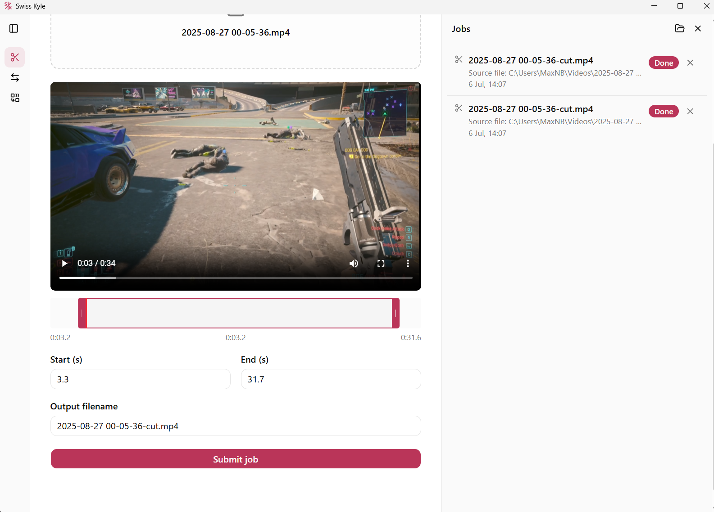
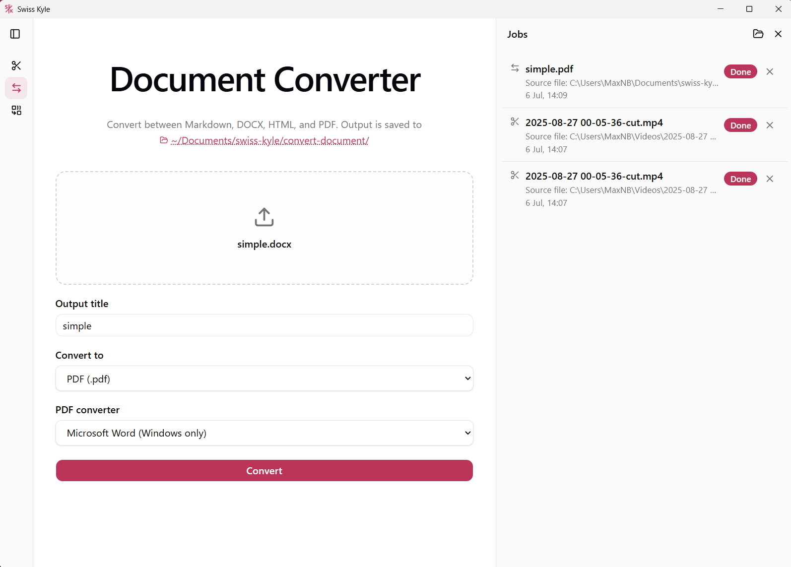
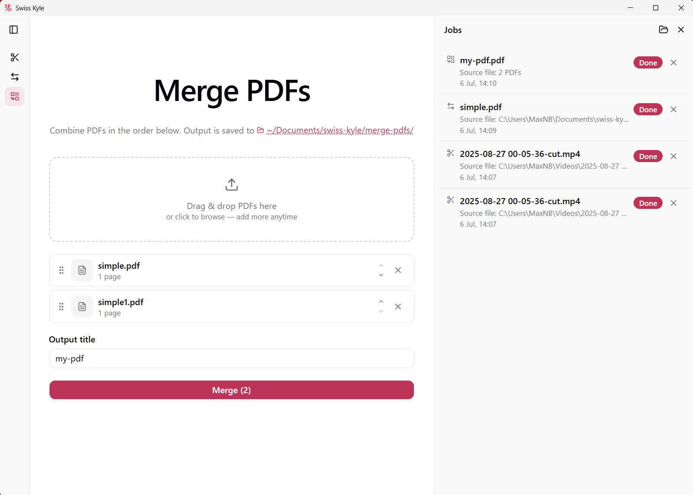

# Swiss Kyle

<p align="center">
  
</p>

A desktop toolbox for local media and document jobs, built with Tauri 2 and React. Everything runs on your machine — no cloud, no uploads.

**Tools:**

- **Cut video** — trim clips with ffmpeg stream copy (`-c copy`), so cuts take seconds regardless of file size, with a scrubbing timeline and in-app preview.
- **Convert documents** — Markdown/HTML/Docx conversions via pandoc, PDF output via typst, and Office formats (doc/docx/odt/rtf) to PDF via LibreOffice or Microsoft Word (Windows only).
- **Merge PDFs** — combine PDFs in a drag-to-reorder list via [pdfcpu](https://pdfcpu.io/).

## Screenshots

<p align="center">
  
  
  
</p>

## How it works

The Tauri shell spawns two kinds of sidecar processes at startup:

- an embedded **NATS server** with JetStream, acting as a durable local job queue
- up to four **worker** processes (one per CPU core, capped at 4) that pull jobs from the queue and drive ffmpeg/pandoc/typst/pdfcpu/LibreOffice/Word

The UI submits jobs through Tauri commands (`src-tauri/src/commands.rs`), which publish job envelopes to JetStream. Workers ack with progress heartbeats while a job runs, so a crashed worker's jobs are redelivered quickly. Status and progress events flow back over NATS and are re-emitted to the UI as `job-status` events.

Video preview is served by a localhost HTTP server that only streams files registered through an unguessable token — it never serves arbitrary paths.

## Repo layout

```
swiss-kyle-ui/        React + Vite frontend (bun)
src-tauri/            Tauri app shell: lifecycle, sidecar spawning, video server, commands
crates/shared/        Job types, NATS publisher, shared helpers
crates/worker/        Worker binary: job consumer + ffmpeg/pandoc/typst/pdfcpu runners
prepare-sidecars.ts   Builds the worker and downloads pinned sidecar binaries
wiki/                 LLM-maintained knowledge base (see CLAUDE.md)
```

## Development

Prerequisites: [Rust](https://rustup.rs/), [Bun](https://bun.sh/), and the [Tauri platform prerequisites](https://tauri.app/start/prerequisites/). For Office-to-PDF conversion you also need LibreOffice or (on Windows) Microsoft Word installed.

```sh
bun install
bun tauri dev
```

The dev command first runs `prepare-sidecars.ts`, which builds the worker crate and downloads sidecar binaries into `src-tauri/binaries/` — pinned versions of nats-server, pandoc, typst, and pdfcpu, plus the latest ffmpeg build. The first run is slow; afterwards the downloads are cached.

On Windows, if the Vite dev port is blocked after a reboot, see [WINDOWS-DEV.md](WINDOWS-DEV.md).

### Tests

```sh
cargo test -p worker
cargo test -p app --lib
```

### Production build

```sh
bun tauri build
```

## Releases

Releases are built by the [release workflow](.github/workflows/release.yml) (manual `workflow_dispatch` with a version input) for macOS (Apple Silicon and Intel), Linux, and Windows.
