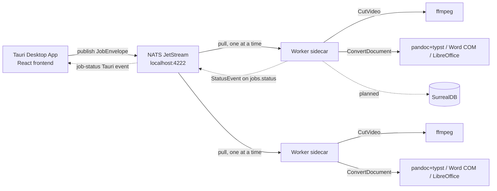

# System Overview

**Type**: architecture
**Summary**: Local-only media processing pipeline — a Tauri desktop app submits jobs through local NATS JetStream to worker sidecars that run ffmpeg (video cutting) or a document converter (pandoc/typst, Word COM, or LibreOffice).
**Tags**: #architecture #nats #tauri #local-first
**Sources**: [[docs/DESIGN.md]]
**Related**: [[wiki/components/job-types]], [[wiki/components/worker]], [[wiki/components/publisher]], [[wiki/components/tauri-app]], [[wiki/decisions/adr-001-local-only]], [[wiki/decisions/adr-002-keep-nats-for-durability]], [[wiki/decisions/adr-003-embedded-surrealdb]], [[wiki/decisions/adr-004-private-sidecar-resources]]
**Last Updated**: 2026-07-03

---

## Overview

The system processes media jobs entirely on the user's machine, with no server and no internet dependency. A Tauri desktop app is the single point of contact with the user's filesystem; it submits jobs to a local NATS JetStream queue; one or more worker sidecars pull jobs and run them through ffmpeg (Cut Video) or the document converter (Doc Converter). Status events flow back through NATS to the Tauri app, which forwards them as Tauri events to the frontend.

All binaries (nats-server, worker, ffmpeg, pandoc, typst, pdfcpu) are bundled via `tauri.conf.json`'s `bundle.resources` into a private per-app directory (not `bundle.externalBin`, which would place them in a shared system path — → [[wiki/decisions/adr-004-private-sidecar-resources]]), prepared by `prepare-sidecars.ts` (run via `bun` in Tauri's `beforeDev`/`beforeBuild` hooks) for the host's Rust target triple. It supports Linux (x86_64/aarch64), macOS (x86_64/aarch64), and Windows (msvc/gnu) — the app is cross-platform (→ [[wiki/components/tauri-app]]).

## Details

Current implementation status:

- The Tauri app (→ [[wiki/components/tauri-app]]) spawns nats-server, one worker per CPU core, and a local video HTTP server as sidecars on startup.
- `Publisher` (→ [[wiki/components/publisher]]) connects to NATS and publishes `JobEnvelope` messages to the `JOBS` JetStream stream with durable acks.
- The worker (→ [[wiki/components/worker]]) handles two job types: `CutVideo` (ffmpeg) and `ConvertDocument` (pandoc+typst for most formats, Word COM or LibreOffice for office → PDF). It streams progress for video jobs and publishes `StatusEvent` updates throughout the job lifecycle.
- Output is written to `~/Documents/swiss-kyle/<tool>/` — `cut-video/` or `convert-document/`.
- SurrealDB is planned for job persistence (→ [[wiki/decisions/adr-003-embedded-surrealdb]]) but not yet implemented (→ [[wiki/issues/missing-db-and-progress]]).
- `cli-publisher` and the Axum HTTP API (`api.rs`) were earlier dev tools, now removed (→ [[wiki/components/cli-publisher]], [[wiki/components/http-api]]).

## Decisions & Rationale

See the linked ADRs: keeping NATS+JetStream for its durability guarantee (→ [[wiki/decisions/adr-002-keep-nats-for-durability]]), and embedding SurrealDB rather than dropping it (→ [[wiki/decisions/adr-003-embedded-surrealdb]]).

## Known Issues / Tech Debt

- No DB wiring — job history resets on app restart (→ [[wiki/issues/missing-db-and-progress]]).
- Process errors shown as raw stderr tail rather than plain-language guidance (→ [[wiki/issues/user-friendly-process-errors]]).

## Related

[[wiki/components/job-types]], [[wiki/concepts/jetstream-pull-consumer]], [[wiki/dependencies/async-nats]]
