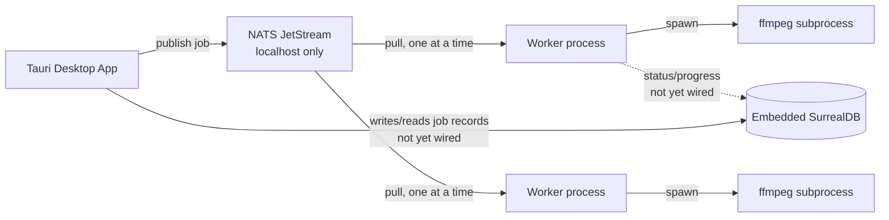

# System Overview

**Type**: architecture
**Summary**: Local-only media processing pipeline — a Tauri desktop app submits video jobs through local NATS JetStream to worker processes that run ffmpeg, with job state in embedded SurrealDB.
**Tags**: #architecture #nats #tauri #local-first
**Sources**: [[docs/DESIGN.md]]
**Related**: [[wiki/components/job-types]], [[wiki/components/worker]], [[wiki/components/publisher]], [[wiki/components/cli-publisher]], [[wiki/components/http-api]], [[wiki/decisions/adr-001-local-only]], [[wiki/decisions/adr-002-keep-nats-for-durability]], [[wiki/decisions/adr-003-embedded-surrealdb]]
**Last Updated**: 2026-06-22

---

## Overview

The system processes video jobs (currently just cutting a clip) entirely on the user's machine, with no server and no internet dependency. A Tauri desktop app is the single point of contact with the user's filesystem and submits jobs; one or more worker processes pull jobs from a local NATS JetStream queue and run them through ffmpeg; job status is recorded in an embedded SurrealDB instance.

This replaces an earlier design where NATS, the API, and SurrealDB ran remotely on a VPS — that design required internet access even for fully local processing. The current design accepts the loss of cross-device job history and multi-user support in exchange for working fully offline (→ [[wiki/decisions/adr-001-local-only]]).

## Details

Current implementation status (as of this snapshot):

- `Publisher` (→ [[wiki/components/publisher]]) connects to NATS and publishes `Job` messages to the `JOBS` stream, durably (JetStream acks).
- The worker (→ [[wiki/components/worker]]) pulls one job at a time from a durable pull consumer named `workers`, runs ffmpeg synchronously, and logs `processing` / `done` / `failed` to stdout/stderr. It does **not** yet write to SurrealDB or report progress.
- `publisher.rs` (→ [[wiki/components/cli-publisher]]) is a CLI binary for manually submitting jobs during development.
- `api.rs` (→ [[wiki/components/http-api]]) is a standalone HTTP service that exposes job submission and a progress websocket — built for the original VPS-backend design and slated for replacement once the Tauri app exists.
- No SurrealDB code exists yet anywhere in the repo (→ [[wiki/issues/missing-db-and-progress]]).

## Decisions & Rationale

See the linked ADRs: keeping NATS+JetStream specifically for its durability guarantee (→ [[wiki/decisions/adr-002-keep-nats-for-durability]]), and embedding SurrealDB rather than dropping it (→ [[wiki/decisions/adr-003-embedded-surrealdb]]).

## Known Issues / Tech Debt

- No DB wiring, no progress parsing — see [[wiki/issues/missing-db-and-progress]].
- `api.rs` duplicates what the Tauri app will eventually do in-process — see [[wiki/issues/api-rs-obsolescence]].
- `src/main.rs` is an unused stub (`fn main() {}`) tied to a `nats-test` binary target nobody runs.
- Nothing in the repo starts `nats-server` or spawns workers automatically; both are run by hand during development, with that responsibility deferred to the future Tauri app's sidecar management.

## Related

[[wiki/components/job-types]], [[wiki/concepts/jetstream-pull-consumer]], [[wiki/dependencies/async-nats]], [[wiki/dependencies/axum]]
